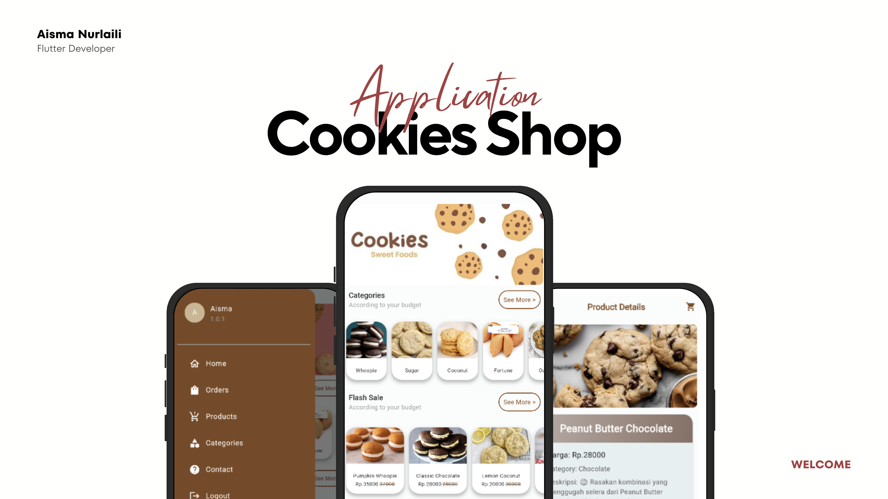

# Cookies Shop: A Flutter-Based E-Commerce Solution for Effortless Cookie Shopping 🍪📱


**Cookies Shop** is an e-commerce application developed using Flutter SDK and Firebase to meet the growing demand for a more practical and efficient way to purchase high-quality cookies. This app is designed as a digital solution to help users easily browse, select, and order various types of cookies from multiple brands without the need to visit physical stores.

## 🍪 Features 
- 👤 User: Product search, flash sales, shopping cart, and QR code payments. 
- 📊 Admin: Dashboard with real-time analytics, order tracking, and inventory management.
- 🖥️ Platform: Developed using Flutter SDK for an interactive interface and Firebase for a reliable backend.
- 🔒 Security and Scalability: Integration of Firebase Authentication and Firestore Database ensures secure and efficient transaction data.
- ☁️ Hosting & Collaboration: Source code managed and shared via GitHub for collaborative development.

## 🛠️ Technologies Used
- Dart: The programming language used for building Flutter applications.
- Flutter: A cross-platform framework for building mobile applications.
- Firebase: A comprehensive platform provided by Google for building mobile and web applications.

## ⚙️ Installation
1. Clone the repository
```
git clone https://github.com/aismaanly/cookies_shop.git
```
2. Navigate to the project directory
```
cd cookies_shop
```
3. Install dependencies
```
flutter pub get
```
4. Set up Firebase for your project by following the instructions provided
5. Run the app
```
flutter run
```

## 💻 Usage
1. User Functionalities
    - Sign in or Sign up: Create an account or log in to access the Cookies Shop application.
    - Explore Home Page: Access the main dashboard with a banner slider showcasing promotions and trending products.
    - Browse Categories: Navigate through categories to find products like chocolate cookies or peanut cookies.
    - Access Flash Sale: View cookies available at discounted prices.
    - View All Products: Explore a list of all available cookies with descriptions and pricing.
    - Manage Cart: Add, update, or remove cookies from the cart before checkout.
    - Profile Management: Review or update personal details like name, email, and address.
    - Contact Support: Access developer contact information or support channels.
    - Logout Securely: End your session to protect your account.
2. Admin Functionalities
    - Dashboard Overview: Monitor monthly order trends using the graphical dashboard on the admin home page.
    - Dashboard Overview: Monitor order trends through the graphical dashboard.
    - Manage Users: Review all registered user accounts in the "All Users" section.
    - View and Edit Orders: Access order details and update order statuses.
    - Product Management: Add, edit, delete, or view details of products.
    - Category Management: Add, edit, or delete product categories.
    - Contact Management: Review contact details for support or inquiries.

## 🗂️ Documentation
[ℹ️ Click here for more information about the Cookies Shop](https://www.canva.com/design/DAGbfLLh4D0/iLQCzcbvN6relyZoq4BaXg/view?utm_content=DAGbfLLh4D0&utm_campaign=designshare&utm_medium=link2&utm_source=uniquelinks&utlId=h192770331b)

## 📱 App Overview
